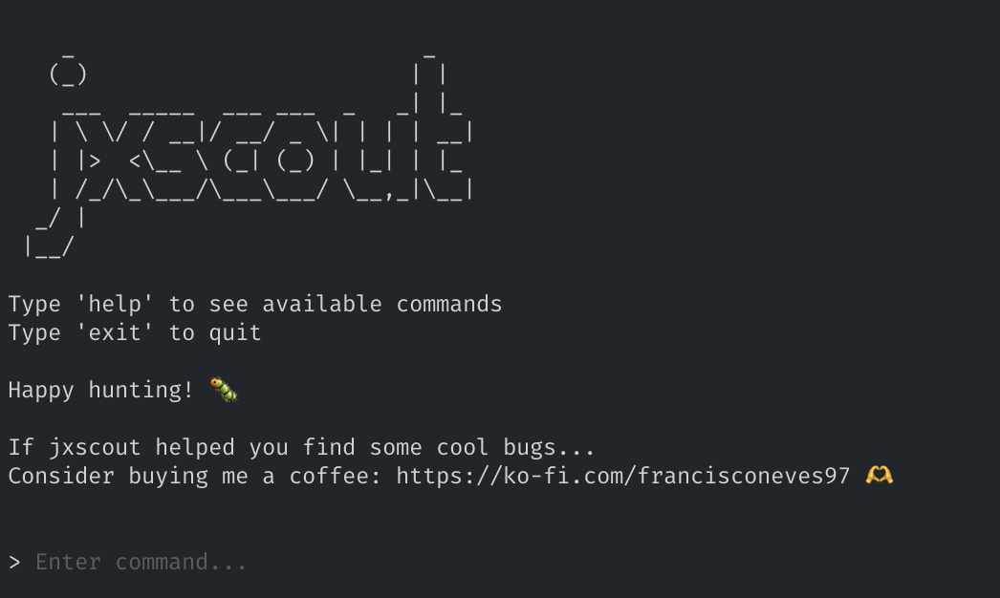

# jxscout

**jxscout** is a tool designed to help security researchers analyze and find vulnerabilities in JavaScript code. It works with your favorite proxy (Burp or Caido), capturing requests and saving optimized versions locally for easy analysis in your preferred code editor.

> Work in Progress 🏗️ jxscout is currently under active development. As it continues to be improved and features expanded there may be breaking changes in future updates.

## Key Features

- **Asset Organization**: Automatically saves and organizes relevant static assets (HTML, JavaScript) into an intuitive folder structure.
- **Chunks Pre-Fetching**: Detects and pre-fetches Webpack and Vite chunks for comprehensive analysis.
- **Code Beautification**: Automatically beautifies JavaScript files, making them easier to read and analyze.
- **Source Map Discovery**: Automatically reverses application source code if .map files are available.
- **AST Analysis**: Automatically analyzes JavaScript files finding interesting functionality for vulnerability researchers. See [VSCode Extension](https://github.com/francisconeves97/jxscout-vscode) to learn how to install the extension.

## Requirements

- **golang**: https://go.dev/doc/install - jxscout is written in golang
- **bun**: https://bun.sh/docs/installation - used for the chunk discovery script

## Installation & Instructions

### Part 1. Installing the CLI

The first step to get up and running with jxscout is to install the CLI. To that, just run the below command or download pre-compiled binary from [release page](https://github.com/francisconeves97/jxscout/releases).

```
go install github.com/francisconeves97/jxscout/cmd/jxscout@latest
```



The jxscout CLI has a prompt with many commands, one of them is `install` which installs `bun` and `prettier`, which are needed dependencies of jxscout. If you don't have those tools installed, feel free to install them manually or by running the `install` command.

### Part 2. Proxy Setup

jxscout will only start capturing assets after you setup your proxy to forward requests to it. To do that, you should install the right plugin for your proxy:

- For Caido users: Check out https://github.com/francisconeves97/jxscout-caido
- For Burp users: Check out https://github.com/francisconeves97/jxscout-burp

After you installed the proxy plugin, every asset that flows through your proxy should be automatically saved to your `~/jxscout` folder.

One useful thing to do is to organize your assets in projects (like you would do on your proxy). To do that you can run `config project-name=my_project` on jxscout CLI and from that moment on assets will be saved in `~/jxscout/my_project`,

If you don't see assets being saved at this point, you should check the Troubleshooting section.

### Part 3. (Optional) VSCode Extension

The VSCode extension is a frontend for jxscout. It allows you to visualize the AST Analysis results of jxscout in a useful tree. It also allows you to copy values from there, including paths and query params for bruteforcing.


To get started with the VSCode Extension head over to https://github.com/francisconeves97/jxscout-vscode for more instructions.

## Usage

```bash
jxscout
```

Once jxscout is running, you can:

- Run the `guide` command for a quick walkthrough
- Run the `help` command for an overview of the available commands
- Watch the video tutorial for a visual guide on configuring and using jxscout

### Demo

Watch the demo movie to see jxscout in action:

https://github.com/user-attachments/assets/64f161c3-46b0-41a9-8b34-706cc795a034

### Available Commands

```
jxscout | static files downloader for vulnerability analysis

Usage:
  /Users/francisconeves/Library/Caches/go-build/fc/fcbb07ff57c271ba8ad3acd462a5ec8f059c84c34d850194af3b4392c78fffa4-d/main [flags]

Flags:
SERVER CONFIGURATION:
   -hostname string  the hostname where jxscout will listen for requests (default "localhost")
   -port int         the port where jxscout will listen for requests (default 3333)

JXSCOUT CONFIGURATION:
   -project-name string  name of your project folder where downloaded files will be stored (default "default")
   -scope string[]       comma-separated list of patterns to filter requests (e.g. *google*,*youtube*)
   -debug                turn on detailed logs for troubleshooting

CONCURRENCY CONFIGURATION:
   -fetch-concurrency int             how many files to download at once (for chunks and source maps) (default 5)
   -save-concurrency int              how many files to save to disk at once (default 5)
   -beautifier-concurrency int        how many files to beautify at once (default 5)
   -chunk-discoverer-concurrency int  how many chunk discovery processes to run at once (default 5)
   -ast-analyzer-concurrency int      how many AST analysis processes to run at once (default 5)

CHUNK DISCOVERY CONFIGURATION:
   -chunk-discoverer-bruteforce-limit int  how many potential chunks to bruteforce when automatic discovery fails (default 3000)

RATE LIMITING CONFIGURATION:
   -rate-limiter-max-requests-per-second int  max requests per second for source maps and chunk discovery (0 = unlimited) (default 2)
   -rate-limiter-max-requests-per-minute int  max requests per minute for source maps and chunk discovery (0 = unlimited)

JS INGESTION CONFIGURATION:
   -download-refered-js  download JS files from out-of-scope domains if they're linked from in-scope pages

LOGGING CONFIGURATION:
   -log-buffer-size int       how many log lines to show in the logs panel (default 10000)
   -log-file-max-size-mb int  max size of the log file in MB (default 10)

OVERRIDES CONFIGURATION:
   -caido-hostname string                  hostname where Caido is running (default "localhost")
   -caido-port int                         port where Caido is running (default 8080)
   -override-content-check-interval value  interval at which to check for changes in override content and update match/replace rules (default 5s)
```

### CLI Options

```bash
jxscout | static files downloader for vulnerability analysis

Usage:
  /Users/francisconeves/Library/Caches/go-build/21/21578004e7aa83d51489155574a36feb8d7489e75edcd2938bd8a3d392f13c9a-d/main [flags]

Flags:
SERVER CONFIGURATION:
   -hostname string  the hostname where jxscout will listen for requests (default "localhost")
   -port int         the port where jxscout will listen for requests (default 3333)

JXSCOUT CONFIGURATION:
   -project-name string  name of your project folder where downloaded files will be stored (default "default")
   -scope string[]       comma-separated list of patterns to filter requests (e.g. *google*,*youtube*)
   -debug                turn on detailed logs for troubleshooting

CONCURRENCY CONFIGURATION:
   -fetch-concurrency int             how many files to download at once (for chunks and source maps) (default 5)
   -save-concurrency int              how many files to save to disk at once (default 5)
   -beautifier-concurrency int        how many files to beautify at once (default 5)
   -chunk-discoverer-concurrency int  how many chunk discovery processes to run at once (default 5)

CHUNK DISCOVERY CONFIGURATION:
   -chunk-discoverer-bruteforce-limit int  how many potential chunks to bruteforce when automatic discovery fails (default 3000)

CACHE CONFIGURATION:
   -js-requests-cache-ttl value    how long to wait before re-downloading the same JS file (default 1h0m0s)
   -html-requests-cache-ttl value  how long to wait before re-downloading the same HTML page (default 1h0m0s)

GIT COMMITER CONFIGURATION:
   -git-commit-interval value  how often commits are made to the working directory (default 5m0s)

RATE LIMITING CONFIGURATION:
   -rate-limiter-max-requests-per-second int  max requests per second for source maps and chunk discovery (0 = unlimited) (default 2)
   -rate-limiter-max-requests-per-minute int  max requests per minute for source maps and chunk discovery (0 = unlimited)

JS INGESTION CONFIGURATION:
   -download-refered-js  download JS files from out-of-scope domains if they're linked from in-scope pages

LOGGING CONFIGURATION:
   -log-buffer-size int       how many log lines to show in the logs panel (default 10000)
   -log-file-max-size-mb int  max size of the log file in MB (default 10)

OVERRIDES CONFIGURATION:
   -caido-hostname string                  hostname where Caido is running (default "localhost")
   -caido-port int                         port where Caido is running (default 8080)
   -override-content-check-interval value  interval at which to check for changes in override content and update match/replace rules (default 5s)
```

## Building locally

1. Clone the repository

```bash
git clone https://github.com/francisconeves97/jxscout.git
cd jxscout
```

2. Install dependencies and build the project

```bash
make install
make build
```

3. Run the server

- Using the binary

```bash
./dist/jxscout
```

- Or directly with Go

```bash
go run cmd/jxscout/main.go
```

4. Setup your proxy to ingest requests into jxscout

### Chunk Discovery Script

The chunk discovery script is written in TypeScript and can be used standalone outside of jxscout. You can use any JS runtime to run it (jxscout uses bun).

You can check the script here: https://github.com/francisconeves97/jxscout/blob/main/pkg/chunk-discoverer/index.ts

The script expects two args:

- The path to the JS file to analyze for webpack chunks
- A bruteforce limit, used when the Webpack chunk loading function can create an unlimited number of valid chunk names.

Example:

```
bun run pkg/chunk-discoverer/index.ts /path/to/the/js/file 10
```

## Contributing

Feel free to leave suggestions and open pull requests, all contributions are welcome!

## Support

Happy hunting! 🐛 If jxscout helped you find cool bugs, [consider buying me a coffee](https://ko-fi.com/francisconeves97)! ☕

## License

This project is licensed under the GNU General Public License. See the COPYING file for the full license text.
